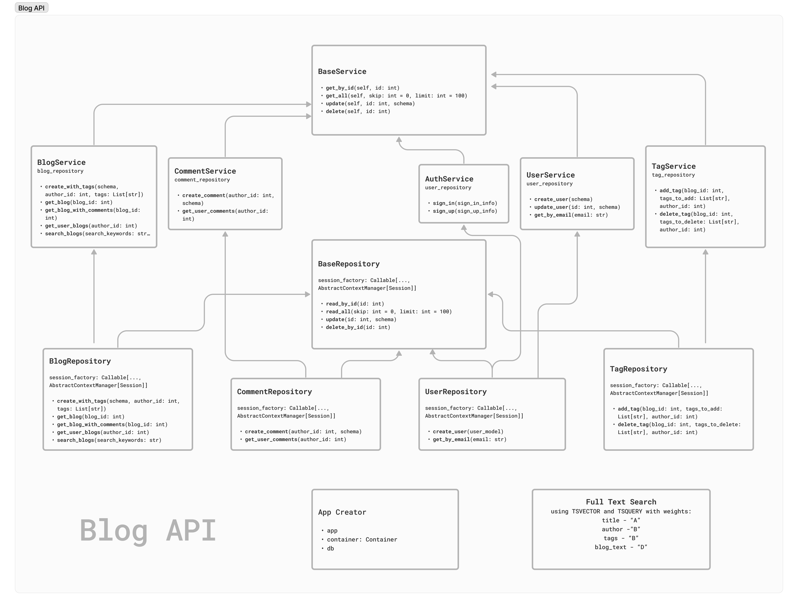

# Blog API 

Welcome to the FastAPI Blog API, a feature-rich API for managing users, blogs, tags, and comments.

## Structure


## Installation
Instructions on how to install and run the project.

### Clone 
```bash
git clone https://github.com/yourusername/fastapi-blog-api.git
```

### Install Requirements
```bash
pip install -r requirements.txt
```

### Run the Server
```bash
uvicorn app.main:app --reload
```
The API will be accessible at http://localhost:8000.


### How to run with Docker Compose
1. Install Docker 
2. Create .env file
3. Run `docker-compose up -d` in the terminal. The -d flag runs the containers in the background. The services defined in the docker-compose.yml file, such as the FastAPI application and PostgreSQL database, will be built and started. 
4. Access the FastAPI application by navigating to http://localhost:8000 in your web browser.

### Sample .env file format
```dotenv
    ENV=env
    DB=postgresql
    DB_USER=
    DB_PASSWORD=
    DB_HOST=localhost
    DB_PORT=5432
   
    SECRET_KEY = "SECRET_KEY_VALUE"
```

## Base Models
1. users
2. blogs [user (1 : n) blog]
3. tags [blog (n : n) tag]
4. comments [user (1 : n) comment], [blog (1 : n) comment]


## Integrated with:
1. Python3.11+
2. Fastapi 0.104.1
3. Database
   1. Postgresql
   2. Migration with Alembic
4. Docker 24.0.7
5. Dependency-injector 
   1. service-repository pattern
6. JWT authentication 
   1. role separation each endpoint


## Fastapi Containers Usage
This project is structured using containers, providing a modular and scalable architecture. Key components include:

1. Services: Business logic and application flow. 
2. Repositories: Data access and interaction with the database.
3. Models: SQLAlchemy models representing database tables.

## Full Text Search using tsvector
This project uses PostreSQL's tsvector and tsquery type which is used for searching through a collection of natural-language documents 
to locate those that best match a query. 
The tsvector type represents a document in a form optimized for text search; the tsquery type similarly represents a text query.
The weights used for this project were (listed from most important ot least important):

1. Title - "A"
2. Author - "B"
3. Tags - "B"
4. Blog_text - "D"

Also, The search results are ordered using ts_rank_cd to provide relevant matches based on the weights assigned.
The combination of tsvector and ts_rank_cd was very important for creating an efficient, and customizable full-text search system which optimized performance.


## References:
1. [Fastapi official documentation](https://fastapi.tiangolo.com/)
2. [Sqlalchemy official documentation](https://docs.sqlalchemy.org/)
3. [Alembic official documentation](https://alembic.sqlalchemy.org/en/latest/)
4. [Docker official tutorial](https://docs.docker.com/get-started/) 
5. [PostrgeSQL Text Search](https://www.postgresql.org/docs/current/textsearch.html)
6. [PostgreSQL Text Search Ranking](https://www.postgresql.org/docs/current/textsearch-controls.html#TEXTSEARCH-RANKING)
